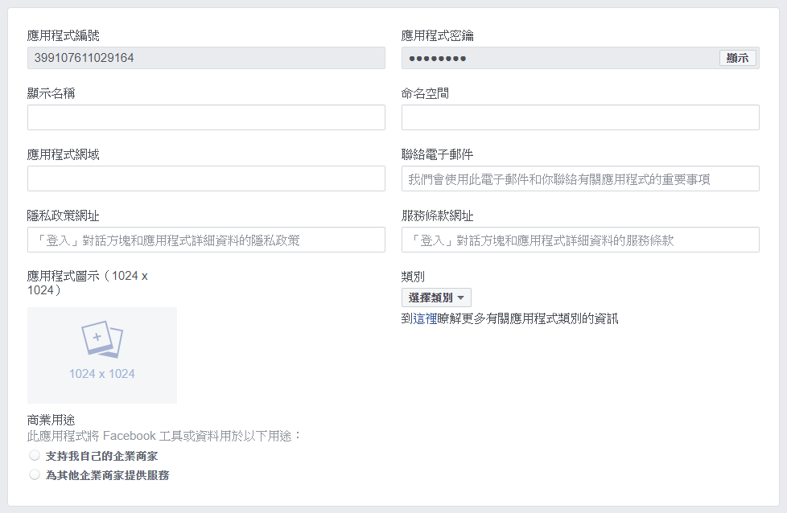
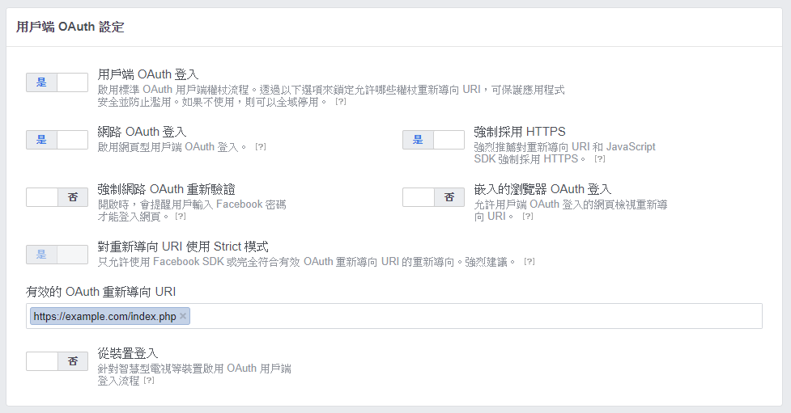

# FACEBOOK 登入

## 事前準備

- 建立 composer.json, 範例如下:

```
{
  "require": {
    "facebook/graph-sdk": "^5.7"
  }
}
```

- 下載 [composer.phar](https://getcomposer.org/download/) 並放入該資料夾
- 進入該資料夾, 並下指令 `php composer.phar install` 安裝套件
- 分別建立 index.php 與 oauth2callback.php 檔案
  - index.php: 登入後取得個人資料
  - oauth2callback.php: 未登入預登入檔

## 申請 API 金鑰

- 進入 [facebook for developers](https://developers.facebook.com) 建立一組專案
- 建立完成後進入該專案儀表板, 點選 `新增應用程式`
- 初步建立建立成功應用程式後, 點選側欄 `設定` > `基本資料`
- 完成 `顯示名稱`, `應用程式網域`, `聯絡電子信箱`, `隱私政策網址`, `服務網址條款` 欄位填寫<br>
  (應用程式網域應為 https://example.com 格式, 不須包含路徑)



- 側欄 `產品` > `新增產品` (加號)
- 新增產品畫面下, 找出 `Facebook 登入` > `設定`
- 側欄 `產品` > `Facebook 登入` > `設定`



- 用戶端 OAuth 設定下, 開啟 `用戶端 OAuth 登入`
- 填寫有效的 OAuth 重新導向 URI<br>
  (該欄位需填寫回調時允許的完整網址, 包含路徑: https://example.com/index.php)
- 儲存變更

## 撰寫程式

- 取得個人資料頁面 : index.php

```
<?php 

  require_once 'vendor/autoload.php';
  session_start();

  $fb = new Facebook\Facebook([
    'app_id'                => '{client_id}',
    'app_secret'            => '{client_secret}',
    'default_graph_version' => 'v4.0',
  ]);

  $helper = $fb->getRedirectLoginHelper();

  try {

    $accessToken = $helper->getAccessToken();

    if (!isset($accessToken)) {
      header('Location: https://example.com/oauth2callback.php');
      exit;
    }

    $response = $fb->get(
      '/me',
      $accessToken->getValue()
    );

    echo '<pre>';
    var_dump($response->getDecodedBody());
    echo '</pre>';

  } catch (Facebook\Exceptions\FacebookResponseException $e) {
    echo 'Graph returned an error: ' . $e->getMessage();
    exit;
  } catch (Facebook\Exceptions\FacebookSDKException $e) {
    echo 'Facebook SDK returned an error: ' . $e->getMessage();
    exit;
  }

```

- 取得 oauth 授權碼頁面 : oauth2callback.php

```
<?php 

  require_once 'vendor/autoload.php';
  session_start();

  $fb = new Facebook\Facebook([
    'app_id'                => '231761923674358',
    'app_secret'            => '2e406a9b8d80c7a20c723cf72d4fdf0b',
    'default_graph_version' => 'v4.0',
  ]);

  $helper = $fb->getRedirectLoginHelper();
  $loginUrl = $helper->getLoginUrl(
    'https://example.com/index.php', 
    ['email']
  );
  
  echo '<a href="' . htmlspecialchars($loginUrl) . '">Facebook登入</a>';

```

## 程式結構

以下為程式結構:

  - 資料夾
    - vendor
    - composer.json
    - composer.lock
    - index.php (取得個人資料頁面)
    - oauth2callback.php (取得 oauth 授權碼頁面)

放置於機器上後,<br>
透過外部 URL 嘗試呼叫,<br>
如果看得到帳號登入後相關資訊即代表成功.