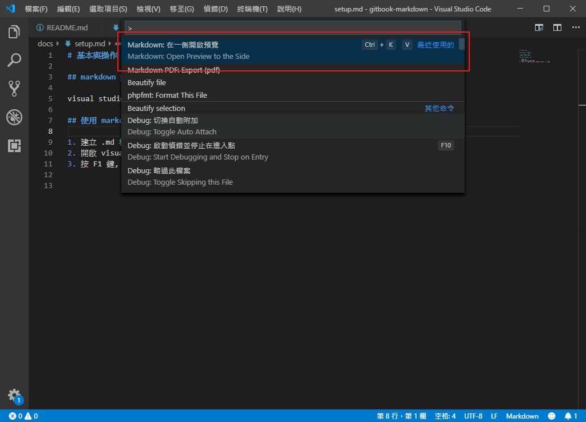
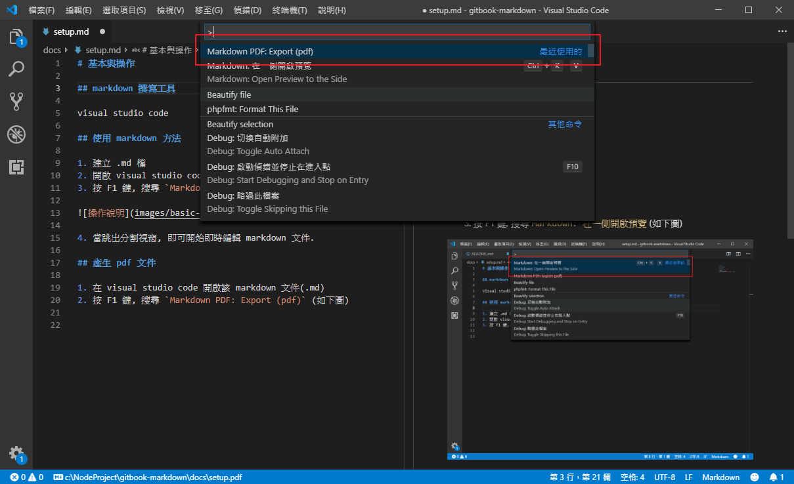
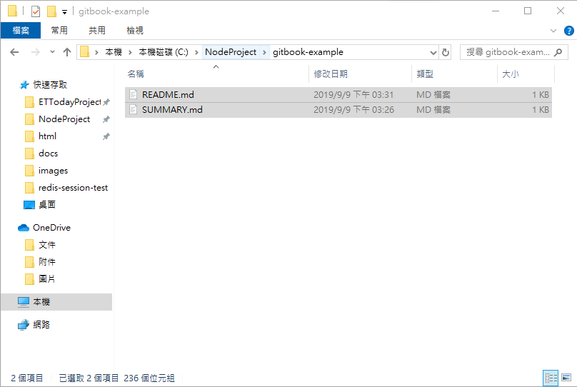

# 基本操作

## markdown 撰寫工具

visual studio code

## 使用 markdown 方法

1. 建立 .md 檔
2. 開啟 visual studio code
3. 按 F1 鍵, 搜尋 `Markdown: 在一側開啟預覽` (如下圖)



4. 當跳出分割視窗, 即可開始即時編輯 markdown 文件

## 產生 pdf 文件

1. 在 visual studio code 開啟該 markdown 文件(.md)
2. 按 F1 鍵, 搜尋 `Markdown PDF: Export (pdf)` (如下圖)



3. 成功後, 在相同的 markdown 文件目錄下, 會產生一隻相同檔名的 pdf 檔

## 建立 gitbook 靜態線上文件

以下教學為 windows 環境

1. 安裝 node
2. 進入 powershell, 並輸入 `npm --v` 確認 npm 可用
3. 輸入 `npm install gitbook -g` 全域安裝 gitbook
4. 建置資料夾, 建議配置如下



> 說明
README.md 為 index 頁面
SUMMARY.md 為側欄頁面

側欄結構大致如下

```
## 章節

* 我是章節
  * [我是頁面1](folder/page1.md)
  * [我是頁面2](folder/page2.md)
  ... 
```

5. powershell 跳至該資料夾, <br>
   並輸入 `gitbook init`, <br>
   完成後會將 SUMMARY.md 所列出的章節自動建立對應的空白檔案.

6. 將所有檔案進行編寫(或已編寫完), <br>
   同樣 powershell 跳到該資料夾並輸入 `gitbook serve`, <br>
   完成後會可在 http://localhost:4000 查看畫面, <br>
   沒問題即可將同資料夾內的 `_book` 資料夾放置於線上空間即可.