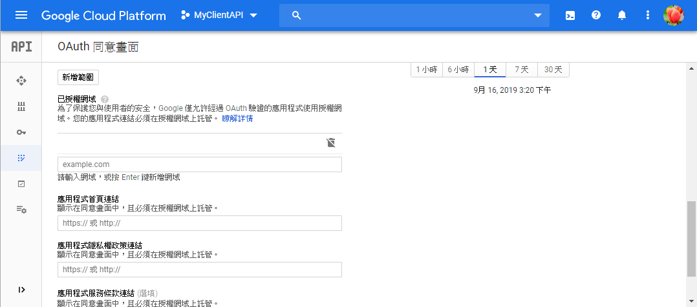
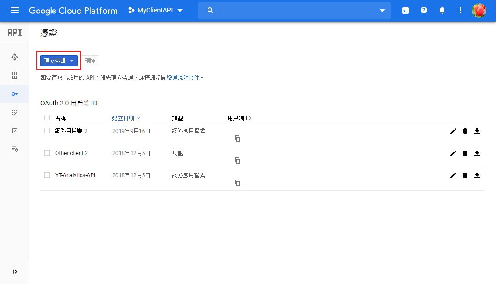
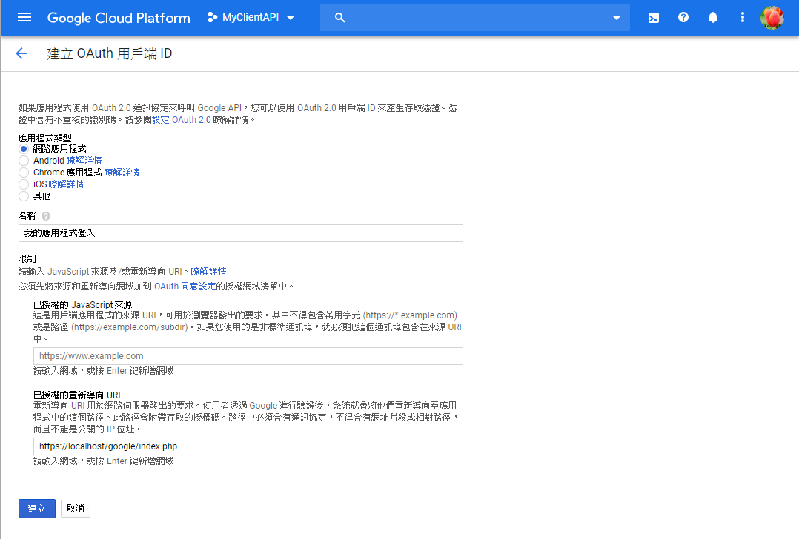
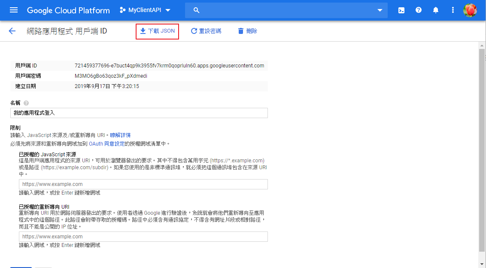

# GOOGLE 登入

## 事前準備

- 建立 composer.json, 範例如下:

```
{
  "require": {
    "google/apiclient": "^2.0"
  }
}
```

- 下載 [composer.phar](https://getcomposer.org/download/) 並放入該資料夾
- 進入該資料夾, 並下指令 `php composer.phar install` 安裝套件
- 分別建立 index.php 與 oauth2callback.php 檔案
  - index.php: 登入後取得個人資料
  - oauth2callback.php: 未登入預登入檔

## 申請 API 金鑰

- 進入 [Google Cloud Platform](https://console.cloud.google.com/) 建立一組專案
- 建立完成後進入該專案儀表板, 點選 `前往 API 總覽`
- 點選側欄 `OAuth同意畫面`
- 完成 `已授權網域`, `應用程式首頁連結`, `應用程式隱私權政策連結`, `應用程式服務條款連結` 欄位填寫



- 選擇側欄 `憑證`
- 點選 `建立憑證` >  `OAuth 用戶端 ID`



- 選擇類型 `網路應用程式`, 並輸入 `名稱` 與 `已授權的重新導向 URI`<br>
  (注意已授權的重新導向 URI 必須是已授權網域網址)



- 完成新增後, 在憑證畫面下 `OAuth 2.0 用戶端 ID` > 剛剛新增的項目
- 點擊 `下載 JSON` 並儲存該檔案



## 撰寫程式

- 取得個人資料頁面 : index.php

```
<?php 

  require_once 'vendor/autoload.php';
  session_start();

  $client = new Google_Client();
  $client->setAuthConfig('client_secret.json');
  $client->addScope(['openid', 'email', 'profile']);

  if (
    isset($_SESSION['access_token']) &&
    $_SESSION['access_token']
  ) {

    $client->setAccessToken($_SESSION['access_token']);
    $oauth   = new Google_Service_Oauth2($client);
    $profile = $oauth->userinfo->get();
    
    echo '<pre>';
    var_export($profile);
    echo '</pre>';

  } else {

    // 無授權碼, 回到 oauth2callback.php 授權頁面
    header('Location: https://example.com/google/oauth2callback.php');

  }

```

- 取得 oauth 授權碼頁面 : oauth2callback.php

```
<?php 

  require_once 'vendor/autoload.php';
  session_start();

  $client = new Google_Client();
  $client->setAuthConfig('client_secret.json');
  $client->setRedirectUri('https://example.com/google/oauth2callback.php');
  
  // 取得的權限類型(這三組不需要額外申請)
  $client->addScope(['openid', 'email', 'profile']);

  // 無授權碼, 去 Google 取得授權資訊
  if (!isset($_GET['code'])) {
    $auth_url = $client->createAuthUrl();
    header('Location: ' . $auth_url);
  }

  // 有授權碼, 去 index.php 取得個人資料
  if (isset($_GET['code'])) {
    $client->authenticate($_GET['code']);
    $_SESSION['access_token'] = $client->getAccessToken();
    header('Location: https://example.com/google/index.php');
  }

```

## 程式結構

以下為程式結構:

  - 資料夾
    - vendor
    - client_secret.json (API金鑰)
    - composer.json
    - composer.lock
    - index.php (取得個人資料頁面)
    - oauth2callback.php (取得 oauth 授權碼頁面)

放置於機器上後,<br>
透過外部 URL 嘗試呼叫,<br>
如果看得到帳號登入後相關資訊即代表成功.