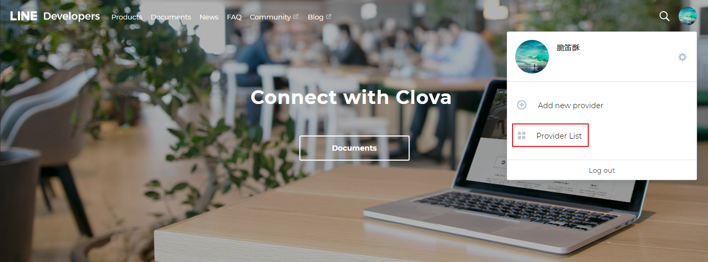
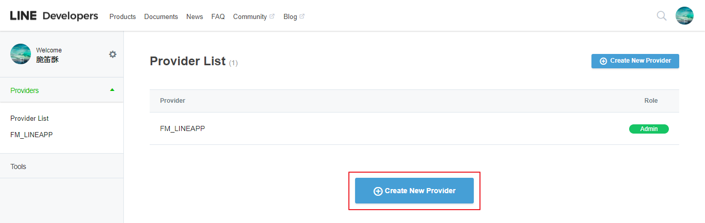
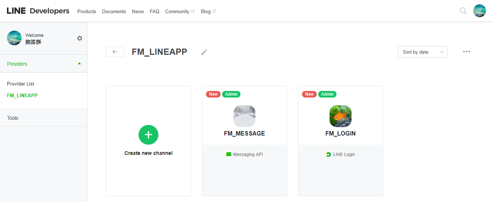
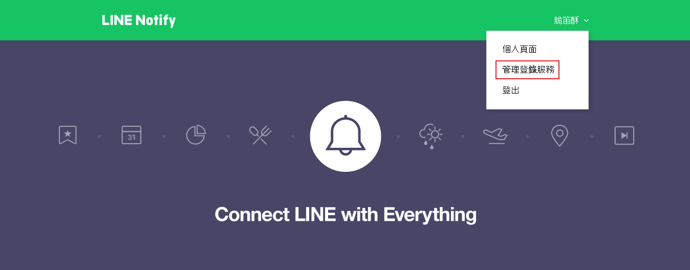

# 應用設置

LINE 後台設置有兩處, 
LOGIN API, MESSAGE API 與 NOTIFY API 後台管理位置不同.

## **新增 LINE 應用(用於 LOGIN API, MESSAGE API)**

> https://developers.line.me/en/

1. 點選登入
2. 右上角個人圖像 > Provider List > Create New Provider

3. Provider List > Create New Provider

4. 新增完成後回 Provider List > 選其中一組 Provider
5. Create new channel > Line Login / Message API 

## **LINE LOGIN 設置**

### channel settings

- App type : WEB

### App settings

- Callback URL : 約定的登入後 URL, 以 Enter 分為多組

## **LINE MESSAGE API 設置**

### channel settings

- App type : BOT
- Plan : Developer Trial
- Available Features: REPLY_MESSAGE / PUSH_MESSAGE (免費版僅有REPLY_MESSAGE)
- Use webhooks : Enabled
- Webhook URL : 當使用者回扣訊息, 接收資訊的網址

### Security settings

- IP address : 限制 API 回調的 IP 位置

## **LINE Notify 設置**

> https://notify-bot.line.me/zh_TW/

1. 上方的網址, 右上角個人名稱 > 管理登錄服務
2. 點選登錄服務

