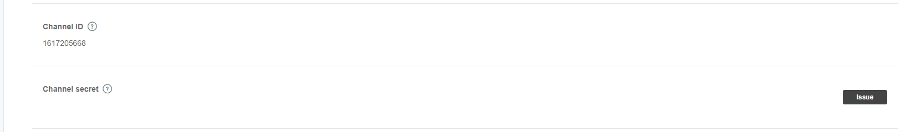

# LINE LOGIN

## 事前準備

需要在下列 LINE 後台新增一組應用

> https://developers.line.me/en/

## LINE 登入流程

1. 前導頁(index.php), 有一個登入按鈕
2. 導入至 LINE 登入頁面
3. 回到指定回扣頁面(callback.phtml, 要在 Callback URL 清單內)
   - 透過 cURL 取得 Token
   - 取得個人資料

## AUTH API 列表

1. authorize: 取得金鑰
  - 方法: GET
  - 網址: https://access.line.me/oauth2/v2.1/authorize
  - params 必要參數列表(application/x-www-form-urlencoded):
    - response_type : 'code' 取得 code, 供未來交換實際 token 用
    - client_id : 你的 Channel ID
      
    - redirect_uri: 你的回扣網址, 要加在清單中
    - scope: 'openid profile' email 已無效
    - state: 防止 csrf 攻擊用欄位, 但我是拿來做溝通用

> 回調內容

- code:  權杖金鑰
- state: 狀態

2. token: 取得 TOKEN
  - 方法: POST
  - 網址: https://api.line.me/oauth2/v2.1/token
  - params 必要參數列表(application/x-www-form-urlencoded):
    - grant_type : authorization_code
    - code : 將剛剛 LINE 登入後回傳的 CODE 取下來放在這
    - redirect_uri: 你的回扣網址, 要加在清單中
    - client_id: 你的 Channel ID
    - client_secret: 你的 Channel Secret
      

> 回調內容

成功後 JSON 內會有 access_token 欄位,<br>
再用 access_token 去取資料

## API 列表

1. profile: 取得個人資料
  - 方法: POST
  - 網址: https://api.line.me/v2/profile
  - header 參數:
    - Authorization: Bearer {auth-token-api 回傳 token 值}

> 回調內容

成功後 JSON 內會有相關使用者資訊


## 程式碼範例

index.php: 登入前導頁

```
<!doctype html>
<html lang="zh-Hant">
  <head>
    <meta charset="utf-8">
    <title>LINE LOGIN</title>
    <script src="https://ajax.googleapis.com/ajax/libs/jquery/3.3.1/jquery.min.js"></script>
  </head>
  <body>
    <h2>LINE LOGIN</h2>
    <hr>
    <a href='#'>LINE登入</a>
  </body>
  <script>
    $('a').on('click', (e) => {

      e.preventDefault();
      
      let uri = 'https://access.line.me/oauth2/v2.1/authorize?';
      let params = {
        response_type: 'code',
        client_id: '{client_id}',
        redirect_uri: 'https://example.com/callback.php',
        scope: 'openid profile',
        state: 'login'
      };
      
      location.href = uri + $.param(params);
      
    });
  </script>
</html>
```

callback.php: 登入後回調頁

````
<?php
      
  $query = isset($_SERVER['QUERY_STRING']) ? $_SERVER['QUERY_STRING'] : false;
  if ($query) {
    parse_str($query, $params);

    /**
     * 1. 取得授權金鑰
     * 2. 取得個人資訊
     */


    if ($params['state'] == 'login') {

      $ch = curl_init();
      $post = [
        'grant_type'    => 'authorization_code',
        'code'          => $params['code'],
        'redirect_uri'  => 'https://example.com/callback.php',
        'client_id'     => '{client_id}',
        'client_secret' => '{client_secret}',
      ];

      curl_setopt($ch, CURLOPT_URL, 'https://api.line.me/oauth2/v2.1/token');
      curl_setopt($ch, CURLOPT_POST, 1);
      curl_setopt($ch, CURLOPT_SSL_VERIFYPEER, false);
      curl_setopt($ch, CURLOPT_POSTFIELDS, http_build_query($post));
      curl_setopt($ch, CURLOPT_RETURNTRANSFER, true);

      $server_output = curl_exec($ch);
      $server_output = json_decode($server_output, 1);
      curl_close($ch);

      if (isset($server_output['access_token'])) {

        $ch = curl_init();
        curl_setopt($ch, CURLOPT_URL, 'https://api.line.me/v2/profile');
        curl_setopt($ch, CURLOPT_SSL_VERIFYPEER, false);
        curl_setopt($ch, CURLOPT_RETURNTRANSFER, true);
        curl_setopt($ch, CURLOPT_HTTPHEADER, [
          sprintf('Authorization: Bearer %s', $server_output['access_token']),
        ]);
  
        $server_output = curl_exec($ch);
        echo $server_output;
  
        curl_close($ch);
      }
    }
  }
  
````