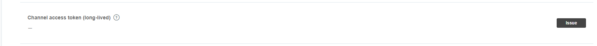

# LINE MESSAGE

## 事前準備

需要在下列 LINE 後台新增一組應用

> https://developers.line.me/en/

### MESSAGE API 流程

**回應流程**

1. 使用者加入 LINEAT, 並第一次留下訊息
2. LINE 將使用者資訊傳到 Webhook 指定網址
3. 觸發 Webhook 網址, 主動向 LINE 取得 Token<br>
   (選用, 也可以在後台產生 longlive 權杖, 這步驟即可省略)
  
4. 發送至 LINE 要回傳的訊息

**廣播流程**

1. 平時紀錄加入本群組的 UserId 資訊
2. 觸發後端 PHP 程式, 主動向 LINE 取得 Token<br>
   (選用, 也可以在後台產生 longlive 權杖, 這步驟即可省略)
   
3. 集體發送至 LINE 要回傳的訊息

## AUTH API 列表

1. token: 取得 TOKEN
  - 方法: POST
  - 網址: https://api.line.me/v2/oauth/accessToken
  - params 必要參數列表(application/x-www-form-urlencoded):
    - grant_type : client_credentials
    - client_id: 你的 Channel ID
    - client_secret: 你的 Channel Secret
      

> 回調內容

成功後 JSON 內會有 access_token 欄位,<br>
再用 access_token 去取資料

## API 列表

1. reply: 回覆訊息
  - 方法: POST
  - 網址: https://api.line.me/v2/bot/message/reply
  - header 參數:
    - Authorization: Bearer {auth-token-api 回傳 token 值}
  - params 必要參數列表(application/json):
    - replyToken: 使用者回覆 token
    - message:
      - type: 訊息類型
      - text: 文字內容

2. multicast: 廣播訊息
  - 方法: POST
  - 網址: https://api.line.me/v2/bot/message/multicast
  - header 參數:
    - Authorization: Bearer {auth-token-api 回傳 token 值}
  - params 必要參數列表(application/json):
    - to: 
      - 發送對象_1
      - 發送對象_2
      - ...
    - message:
      - type: 訊息類型
      - text: 文字內容

## 程式碼範例

reply.php: 回覆訊息

```
<?php

  $ch = curl_init();
  $post = [
    'grant_type'    => 'client_credentials',
    'client_id'     => '{client_id}',
    'client_secret' => '{client_secret}',
  ];

  curl_setopt($ch, CURLOPT_URL, 'https://api.line.me/v2/oauth/accessToken');
  curl_setopt($ch, CURLOPT_POST, 1);
  curl_setopt($ch, CURLOPT_SSL_VERIFYPEER, false);
  curl_setopt($ch, CURLOPT_POSTFIELDS, http_build_query($post));
  curl_setopt($ch, CURLOPT_RETURNTRANSFER, true);

  $server_output = curl_exec($ch);
  $server_output = json_decode($server_output, 1);
  curl_close($ch);

  if (isset($server_output['access_token'])) {
    
    $content = file_get_contents('php://input', 'r');
    $content = json_decode($content, 1);
    
    $ch = curl_init();
    $post = [
      'replyToken' => $content['events'][0]['replyToken'],
      'messages'   => [
        [
          'type' => 'text',
          'text' => '{message}'
        ] 
      ],
    ];

    curl_setopt($ch, CURLOPT_URL, 'https://api.line.me/v2/bot/message/reply');
    curl_setopt($ch, CURLOPT_POST, 1);
    curl_setopt($ch, CURLOPT_SSL_VERIFYPEER, false);
    curl_setopt($ch, CURLOPT_POSTFIELDS, json_encode($post));
    curl_setopt($ch, CURLOPT_RETURNTRANSFER, true);
    curl_setopt($ch, CURLOPT_HTTPHEADER, [
      sprintf('authorization: Bearer %s', $server_output['access_token']),
      'Content-Type: application/json'
    ]);

    $server_output = curl_exec($ch);
    curl_close($ch);
  }

```

multicast.php: 廣播訊息

```
<?php

  $ch = curl_init();
  $post = [
    'grant_type'    => 'client_credentials',
    'client_id'     => '{client_id}',
    'client_secret' => '{client_secret}',
  ];

  curl_setopt($ch, CURLOPT_URL, 'https://api.line.me/v2/oauth/accessToken');
  curl_setopt($ch, CURLOPT_POST, 1);
  curl_setopt($ch, CURLOPT_SSL_VERIFYPEER, false);
  curl_setopt($ch, CURLOPT_POSTFIELDS, http_build_query($post));
  curl_setopt($ch, CURLOPT_RETURNTRANSFER, true);

  $server_output = curl_exec($ch);
  $server_output = json_decode($server_output, 1);
  curl_close($ch);

  if (isset($server_output['access_token'])) {
    
    $content = file_get_contents('php://input', 'r');
    $content = json_decode($content, 1);
    
    $ch = curl_init();
    $post = [
      'to' => [
        '{userId_1}',
        '{userId_2}',
      ],
      'messages'   => [
        [
          'type' => 'text',
          'text' => '{message}'
        ]
      ],
    ];

    curl_setopt($ch, CURLOPT_URL, 'https://api.line.me/v2/bot/message/multicast');
    curl_setopt($ch, CURLOPT_POST, 1);
    curl_setopt($ch, CURLOPT_SSL_VERIFYPEER, false);
    curl_setopt($ch, CURLOPT_POSTFIELDS, json_encode($post));
    curl_setopt($ch, CURLOPT_RETURNTRANSFER, true);
    curl_setopt($ch, CURLOPT_HTTPHEADER, [
      sprintf('authorization: Bearer %s', $server_output['access_token']),
      'Content-Type: application/json'
    ]);

    $server_output = curl_exec($ch);
    echo $server_output;
    curl_close($ch);
  }

```