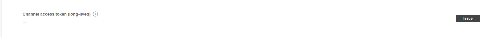

# LINE NOTIFY

## 事前準備

需要在下列 LINE 後台新增一組應用

> https://developers.line.me/en/

### NOTIFY API 流程

1. 註冊 Notify API服務, 並選擇指定傳送訊息對象或群組, 並記錄TOKEN
  
2. LINE Notify 帳號會跳出與「XXX」連動完成
3. 透過 API 發送至 LINE, 以觸發通知

## AUTH API 列表

1. authorize: 取得金鑰
  - 方法: GET
  - 網址: https://notify-bot.line.me/oauth/authorize
  - params 必要參數列表(form):
    - response_type : 'code' 取得 code, 供未來交換實際 token 用
    - client_id : 你的 Channel ID
      
    - redirect_uri: 你的回扣網址, 要加在清單中
    - scope: 'openid profile' email 已無效
    - state: 防止 csrf 攻擊用欄位, 但我是拿來做溝通用

2. token: 取得 TOKEN
  - 方法: POST
  - 網址: https://notify-bot.line.me/oauth/token
  - params 必要參數列表(form):
    - grant_type : authorization_code
    - code : 將剛剛 LINE 登入後回傳的 CODE 取下來放在這
    - redirect_uri: 你的回扣網址, 要加在清單中
    - client_id: 你的 Channel ID
    - client_secret: 你的 Channel Secret
      

## API 列表

1. notify: 訊息通知
  - 方法: POST
  - 網址: https://api.line.me/v2/bot/message/reply
  - header 參數:
    - Authorization: Bearer {剛剛取得的TOKEN}
  - params 必要參數列表(application/x-www-form-urlencoded):
    - messages: 傳送的訊息

## 程式碼範例

index.php : 註冊 Notify 服務

```
<!doctype html>
<html lang="zh-Hant">
  <head>
    <meta charset="utf-8">
    <title>LINE NOTIFY</title>
    <script src="https://ajax.googleapis.com/ajax/libs/jquery/3.3.1/jquery.min.js"></script>
  </head>
  <body>
    <h2>LINE NOTIFY</h2>
    <hr>
    <a href='#'>註冊通知服務</a>
  </body>
  <script>
    $('a').on('click', (e) => {

      e.preventDefault();
      
      let uri = 'https://notify-bot.line.me/oauth/authorize?';
      let params = {
        response_type: 'code',
        client_id: '8ACEHD3sGtrOsJALEuDtpc',
        redirect_uri: 'https://example.com/callback.php',
        scope: 'notify',
        state: 'register'
      };

      location.href = uri + $.param(params);
      
    });
  </script>
</html>
```

send_message.php: 發送訊息

```
<!doctype html>
<html lang="zh-Hant">
  <head>
    <meta charset="utf-8">
    <title>發送訊息</title>
  </head>
  <body>
    <h2>發送訊息</h2>
    <hr>
    <form method='GET' action='callback.php'>
      <input type='text' name='message' placeholder='&nbsp;type some text' />
      <input type='hidden' name='state' value='notify' />
      <input type='submit' value='submit' />
    </form>
  </body>
</html>
```

callback.php: 回調頁, state 參數有兩組方法:
- register: notify 服務連動
- notify: 發送訊息

````
<?php
      
  $query = isset($_SERVER['QUERY_STRING']) ? $_SERVER['QUERY_STRING'] : false;

  if ($query) {
    parse_str($query, $params);

    if ($params['state'] == 'register') {

      $ch = curl_init();
      $post = [
        'grant_type'    => 'authorization_code',
        'code'          => $params['code'],
        'redirect_uri'  => 'https://example.com/callback.php',
        'client_id'     => '{client_id}',
        'client_secret' => '{client_secret}',
      ];

      curl_setopt($ch, CURLOPT_URL, 'https://notify-bot.line.me/oauth/token');
      curl_setopt($ch, CURLOPT_POST, 1);
      curl_setopt($ch, CURLOPT_SSL_VERIFYPEER, false);
      curl_setopt($ch, CURLOPT_POSTFIELDS, http_build_query($post));
      curl_setopt($ch, CURLOPT_RETURNTRANSFER, true);

      $server_output = curl_exec($ch);
      $server_output = json_decode($server_output, 1);

      if (isset($server_output['access_token'])) {
        file_put_contents('token.txt', $server_output['access_token']);
        echo 'OK';
      }

      curl_close($ch);
    }

    if ($params['state'] == 'notify') {

      $ch = curl_init();
      $post = [
        'message' => $params['message'],
      ];

      curl_setopt($ch, CURLOPT_URL, 'https://notify-api.line.me/api/notify');
      curl_setopt($ch, CURLOPT_POST, 1);
      curl_setopt($ch, CURLOPT_SSL_VERIFYPEER, false);
      curl_setopt($ch, CURLOPT_POSTFIELDS, http_build_query($post));
      curl_setopt($ch, CURLOPT_RETURNTRANSFER, true);
      curl_setopt($ch, CURLOPT_HTTPHEADER, [
        sprintf('authorization: Bearer %s', file_get_contents('token.txt')),
      ]);

      $server_output = curl_exec($ch);
      echo $server_output;

      curl_close($ch);
    }
  }
  
````