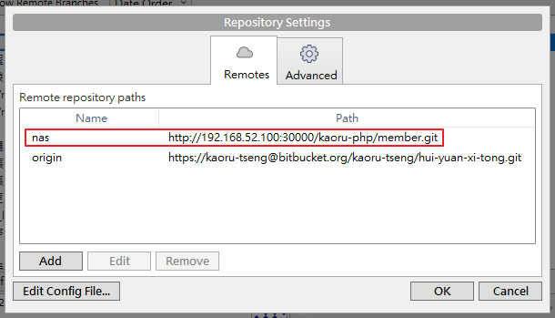
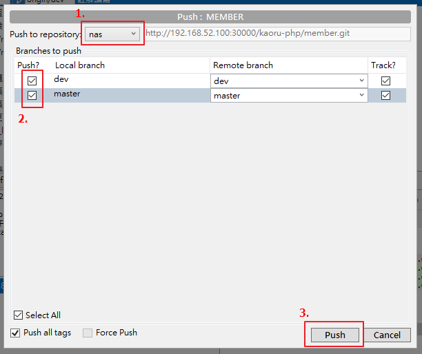
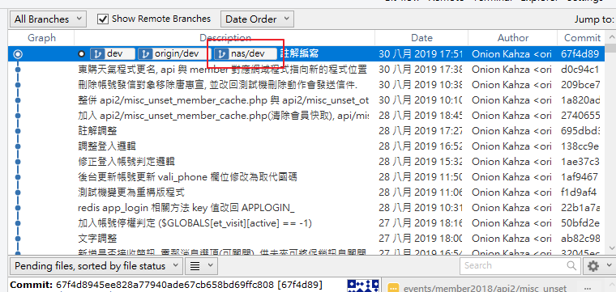

# 在群組建立專案並轉移

以下為在群組建立專案的步驟

1. Gitlab 首頁下, 選擇上方功能條的 \`Groups\`
2. 選擇群組
3. 進入群組畫面後, 點選綠色按鈕 \`New project\`
4. 在 New project 畫面下, 填寫以下訊息.
   - Project path: 選擇要新增專案在哪個群組, 或是個人專案下.
   - Project name: 專案名稱, 建議儘量不要重複, 未來有需求可進行專案轉移.
   - Project description: 專案描述
   - Visibility Level: 專案可視度, 如果群組為 Private, 專案僅可選 Private.
     - Private: 指定用戶, 並依照需求調整操作權限.
     - Internal: 所有 Gitlab 用戶.
     - Public: 公開.
5. 完成後, 點選綠色按鈕 \`Create project\`

以下為透過本機端 SourceTree 轉移至 nas 的步驟

1. 進入建立好的群組專案, 並複製網址連結.(*1)
2. 開啟本機端 SourceTree 專案, 並選擇上方功能條的 \`Repository\` > \`Repository Settings\`
3. 選擇 \`Remotes\` 分頁, 點選 Add, 並新增以下設置後, 點選 OK.
   - Remote repository paths 為空:
     - Remote name 不填寫, 直接 Default remote 打勾.
     - URL / Path 貼上從 Gitlab 所複製的連結.
   - Remote repository paths 有至少一組設置時:
     - Remote name 填寫任意名稱(如 gitlab).
     - URL / Path 貼上從 Gitlab 所複製的連結.

4. 回到 SourceTree 主畫面, 點選按鈕 \`Push\`, 並完成以下事項.
   - Push to repository 選擇剛所新增的專案.
   - 選擇要推送的分支.
   - 點選 \`Push\`

5. 當 SourceTree 遠端分支與當前狀態一致時, 即代表已成功推上 Gitlab.

