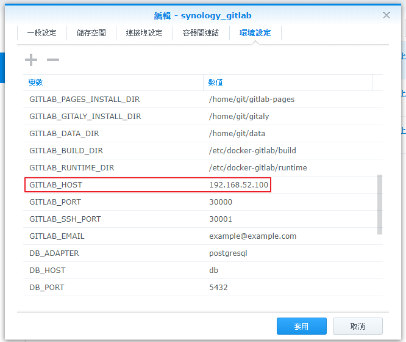

# 基本操作

以下為在 NAS 機器上安裝 Gitlab 方法

1. 登入 NAS 管理介面
2. 點選 \`套件中心\` 並搜尋 Gitlab
3. 點選按鈕 \`安裝\`
4. 安裝完成後, 未啟動 Gitlab 下, 點選 \`主選單\` > \`Docker\`
5. 進入 \`Docker\` 後, 在 \`synology_gitlab\` 右鍵 > \`編輯\`
6. 上方功能條選擇 \`環境變數\` 分頁, 找出並修改下列參數
   - GITLAB_HOST: 當前 nas 的 IP 位置

7. 回到套件中心 > 左方功能條 \`已安裝\` 找出 Gitlab 並點按鈕 \`啟動\`
8. 等待就緒後, 進入 Gitlab 畫面.
9. 第一次進入畫面會要求輸入 root 帳密, 請妥善保存此資訊.

以下為 NAS 重啟方法

1. 登入 NAS 管理介面
2. 點選 \`套件中心\` 並搜尋 Gitlab
3. 點選 \`停用\`, 靜待停止後再點選 \`啟用\` 即完成 Gitlab 重啟.